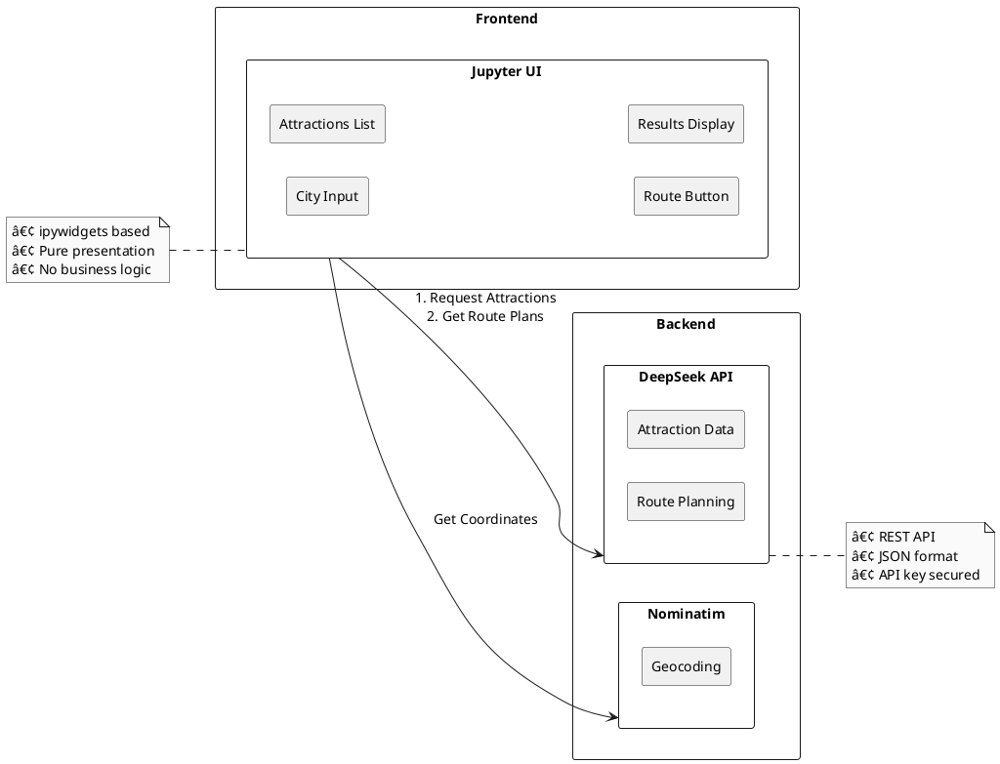

# 🌠Lazy Tourist - 智能旅行路线规划工具


## 📌 项目简介

**Lazy Tourist** 是一款基äºPythonå¼€å‘的智能旅行助手，帮助旅行者快速å‘ç°åŸå¸‚热门景点并自动生æˆä¼˜åŒ–路线。åªéœ€è¾“å…¥åŸå¸‚å称，å³å¯è·å¾—：

- 该åŸå¸‚最å—欢è¿çš„景点列表
- 景点的详细信æ¯å’Œè¯„分
- 智能规划的游览路线
- 一键生æˆå¯¼èˆªé“¾æ¥

## ✨ 功能特性

- ğŸ™ï¸ åŸå¸‚景点智能æ¨è
- ⭠基äºè¯„分的景点æ’åº
- ğŸ—ºï¸ è‡ªåŠ¨è·¯çº¿è§„åˆ’
- 🔗 快速导航链æ¥ç”Ÿæˆ
- ğŸ–¥ï¸ ç®€æ´çš„交互å¼ç•Œé¢

## ğŸ› ï¸ æŠ€æœ¯æ¶æ„


```plantuml
@startuml LazyTourist-Architecture
skinparam monochrome true
skinparam shadowing false
skinparam defaultFontName Arial
skinparam defaultFontSize 14

left to right direction

rectangle "Frontend" {
  rectangle "Jupyter UI" as ui {
    rectangle "City Input"
    rectangle "Attractions List"
    rectangle "Route Button"
    rectangle "Results Display"
  }
}

rectangle "Backend" {
  rectangle "DeepSeek API" as deepseek {
    rectangle "Attraction Data"
    rectangle "Route Planning"
  }
  
  rectangle "Nominatim" as nominatim {
    rectangle "Geocoding"
  }
}

ui --> deepseek : 1. Request Attractions\n2. Get Route Plans
ui --> nominatim : Get Coordinates

note right of deepseek
  • REST API
  • JSON format
  • API key secured
end note

note left of ui
  • ipywidgets based
  • Pure presentation
  • No business logic
end note
@enduml
```

## 🚀 快速开始

### 安装ä¾èµ–

```bash
pip install ipywidgets requests geopy
```

### 使用方法

1. è¿è¡ŒJupyter Notebook
```bash
jupyter notebook
```

2. 导入并åˆå§‹åŒ–应用
```python
from lazy_tourist import LazyTouristApp
app = LazyTouristApp()
```

3. 按照界é¢æ示æ“作：
   - 输入åŸå¸‚å称
   - ä»åˆ—表选择感兴趣的景点
   - 生æˆä¼˜åŒ–路线

## 📠使用示例


1. 输入"Paris"æœç´¢å·´é»æ™¯ç‚¹
2. 选择埃è²å°”é“å¡”ã€å¢æµ®å®«ç­‰æ™¯ç‚¹
3. 生æˆæœ€ä¼˜æ¸¸è§ˆè·¯çº¿
4. è·å–路线详情和导航链æ¥

## 🤠贡献指å—

欢è¿æ交Pull Request或Issueï¼

## 📄 许å¯è¯

MIT License

---

**Happy Traveling!** ✈ï¸ğŸŒ
